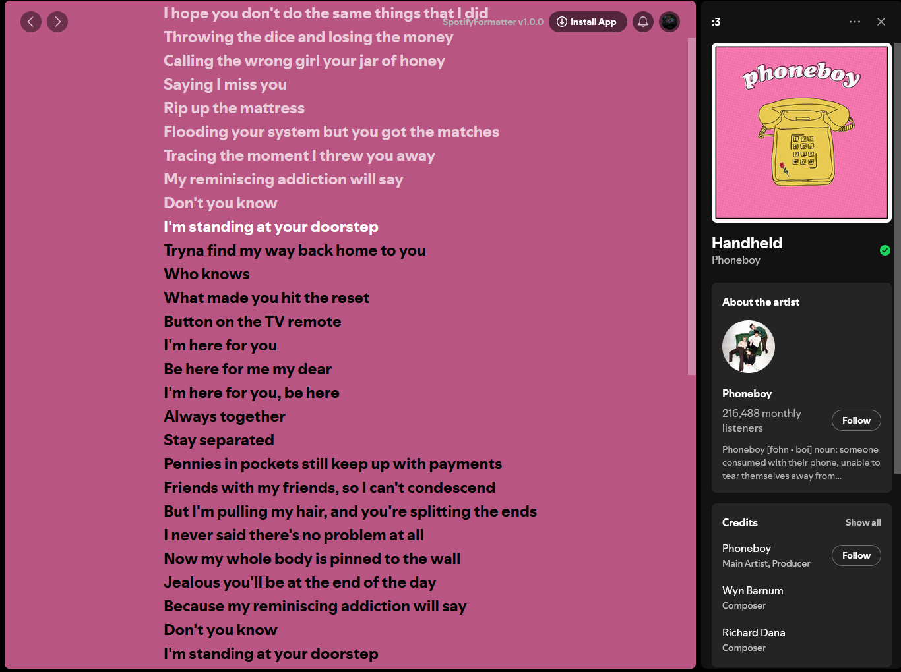

# SpotifyFormatter

Break free from the shackles of fascism and rampant consumerism (Spotify removing free features).  

An extension/script to bring back lyrics for free users.

## Advanced synced lyrics  

Remember this?  

**SpotifyFormatter** is able to find that song's lyrics, and time-sync them.  

## Existing songs with lyrics

### Turn this screen of doom into a screen of pure joy with SpotifyFormatter

## Features

SpotifyFormatter leaves the experience as close to stock, as it used to be.  

- Millisecond-based time synced lyrics for many songs that previously didn't have them
  - Example: the screen that says "You\'re gonna have to guess the lyrics for this one."
- Smooth scrolling
  - Makes the experience better with fluid motion!
- Uses all spotify colors
  - SpotifyFormatter mimics the Premium feel as close as possible.
- Fullscreen support
  - Supports every song that officially has lyrics
  - Sadly does not work with songs that don't officially have lyrics

## Usage: Extension

To get started with SpotifyFormatter,

- 1. Go to `https://open.spotify.com`.
- 2. Play any song and click the lyrics button
- 3. You should see the lyrics!! If you see the premium prompt, close the lyrics window and re-open it.

## Usage: Script

If you don't want to use this as an extension, you can:

- 1. Copy all contents of `script.js`.
- 2. Go to `https://open.spotify.com`.
- 3. Open Developer Tools (CTRL+Shift+I or F12) and paste the script code in the console.
- 4. Play any song and click the lyrics button
- 5. You should see the lyrics!! If you see the premium prompt, close the lyrics window and re-open it.

## Lyrics not showing up?

If you've tried closing the lyrics window and reopening it and they don't show...

- Open the lyrics view (with the button)
- Open Developer Tools (CTRL+Shift+I or F12)
- Type `spotifyFormatter.runLyrics()` and you should see them!!!
- Still not seeing them?
  - DM me (@ia.74) on Discord or make an issue here!

Enjoy a better Spotify experience.  
